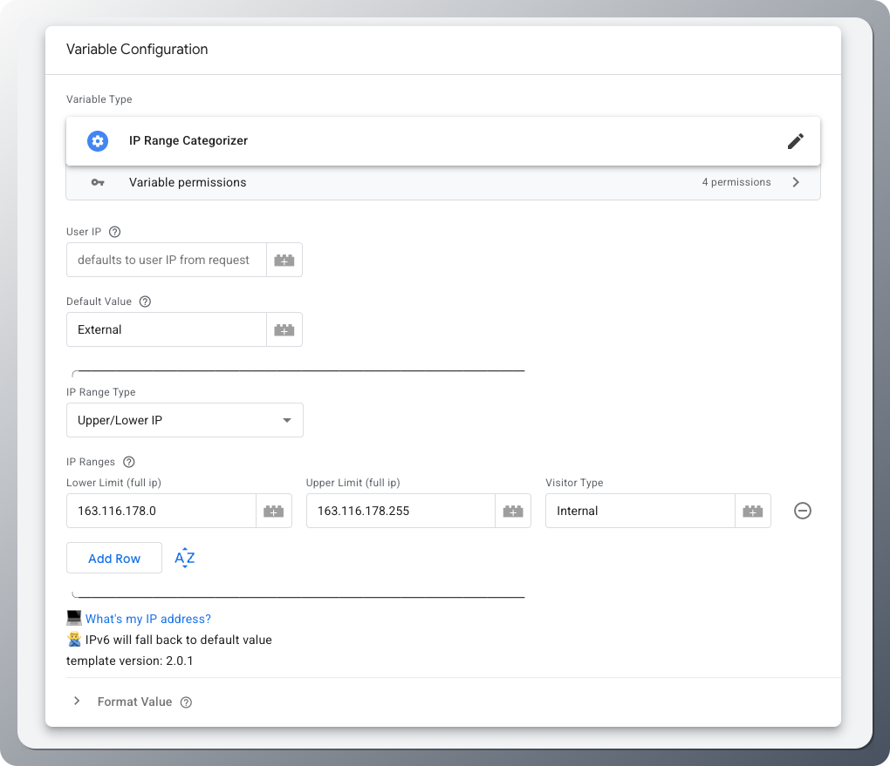

# IP Range Categorizer

## Overview

The IP Range Categorizer variable is a Google Tag Manager server-side template that automatically classifies visitor IP addresses into predefined categories based on IP ranges. This powerful variable enables you to categorize traffic, filter internal users, segment audiences, and enhance your analytics data quality by identifying different types of visitors based on their network location.

The variable supports two IP range formats:
- **CIDR notation** (e.g., `192.168.1.0/24`) - Modern, efficient format for defining network ranges
- **Upper/Lower range lookup** (e.g., `192.168.1.1` to `192.168.1.255`) - Legacy format for precise range definitions

When an IP address doesn't match any configured range, the variable returns a default value. IPv6 addresses are currently not supported and will return the default value with an "_ipv6" suffix.

## Example Use Case: Internal Traffic Filtering for Analytics

**Scenario**: A company wants to exclude internal employee traffic from their Google Analytics data to get accurate visitor metrics.

**Implementation**:
- Configure the variable with your company's IP ranges:
  - Office network: `203.0.113.0/24` → "internal"
  - VPN range: `198.51.100.0/25` → "internal"  
  - Remote office: `192.0.2.10` to `192.0.2.20` → "internal"
  - Default value: "external"

**Usage**: Use this variable as a condition in your GA4 tags to only fire for "external" visitors, or create separate GA4 properties for internal vs external traffic analysis.

## Setup
1. **Import the Template**
   - Download the template file to your computer
   - Import it into your GTM Server Container following [Google's template import guide](https://developers.google.com/tag-platform/tag-manager/templates#export_and_import)

2. **Create the Variable**
   - In your GTM workspace, create a new variable using the imported template
   - Choose your preferred lookup method:
     - **CIDR Ranges** (recommended): More efficient for large network ranges
     - **Upper/Lower Range Lookup**: More precise control for specific IP ranges

3. **Configure IP Ranges**
   - Add your IP ranges and their corresponding category labels
   - Set a default value for unmatched IPs
   - Test the configuration using the preview mode

## Testing
To verify the variable works correctly with your own IP address:

1. **Find Your IP Address**
   - Search "what's my ip address" in Google to discover your public IP

2. **Configure Test Range**
   - Add your IP address to one of the ranges in your variable configuration
   - Assign a recognizable category value (e.g., "test_ip")

3. **Verify in Preview Mode**
   - Use GTM's preview mode on your server container
   - Check that the variable returns your expected category value
   - Monitor the variable's output in the debug console
